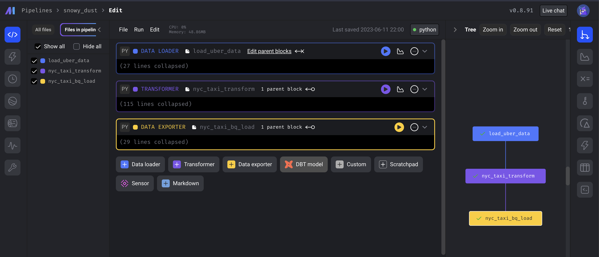
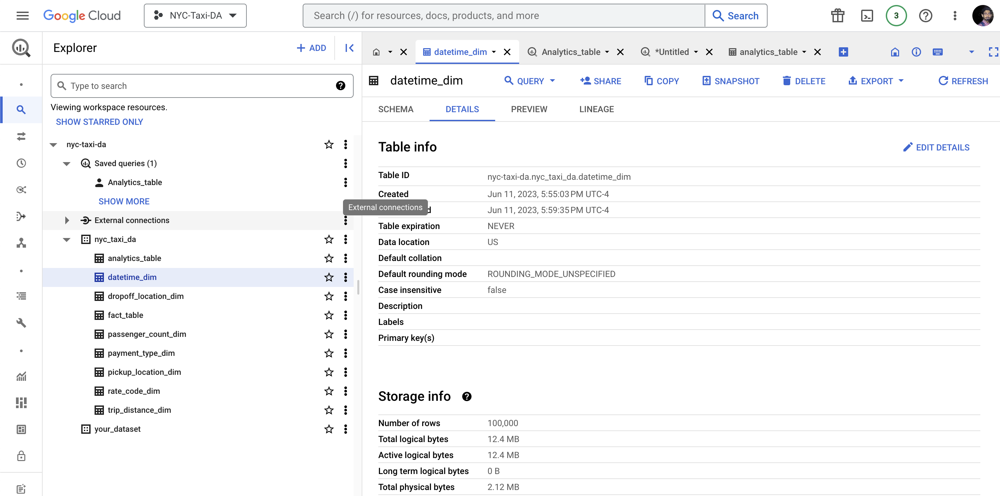

# COVID-19 Impact on New York Taxi Trips Analysis

This repository contains the code and resources for the project "Analyzing COVID-19's Impact on New York Taxi Trips" conducted at Northeastern University from April 2023 to May 2023. The aim of this project was to investigate the impact of the COVID-19 pandemic on taxi trips in New York City.

## Tools and Technologies Used

<ul>
<li>Python: Used for data analysis and processing</li>
<li>SQL: Utilized for querying and transforming the data</li>
<li>Google Cloud Platform (GCP): Used GCP services for data storage and processing
</li>
<li>
BigQuery: Employed for data storage and querying large datasets
</li>
<li>
Tableau: Utilized for creating data visualizations
</li>
</ul>

## Project Steps and Methodology

<ul>
<li><b>Data Collection: </b> Obtained the New York TLC Trip Record Data, which contains information about taxi trips in New York City.</li>

<ul>
<li>https://www.nyc.gov/site/tlc/about/tlc-trip-record-data.page

</ul>

<li>
<b>Data Exploration:</b> Conducted exploratory data analysis to understand the structure and content of the dataset.

</li>
<li>
<b>Data Cleaning and Transformation:</b> Preprocessed and transformed the data to make it suitable for analysis. This step involved handling missing values, data formatting, and data type conversions.
</li>
<li>
<b>Data Modeling:</b> Designed and developed a scalable data pipeline using Mage Data Pipeline Tool for ETL (Extract, Transform, Load) automation. The data pipeline involved modeling the data into a star schema with fact and dimension tables to facilitate efficient querying and analysis.
</li>
 

 
<li>
<b>Data Analysis:</b> Utilized SQL queries to perform data analysis and identify the impact of COVID-19 on taxi trips. Explored various factors such as trip volume, trip duration, and revenue changes during different phases of the pandemic.
<li>
<b>Data Visualization:</b> Created interactive and informative data visualizations using Tableau. These visualizations helped in gaining insights into taxi trip trends and provided valuable information for transportation industry decisions.
</li>
</ul>

## Project Results and Findings

The analysis revealed significant changes in New York taxi trips due to the COVID-19 pandemic. It highlighted fluctuations in trip volume, changes in trip patterns, and revenue impacts. These findings can be used by transportation authorities and industry stakeholders to adapt their strategies and make informed decisions.

